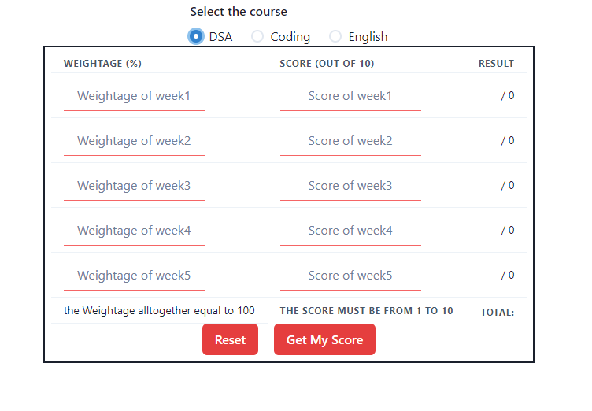
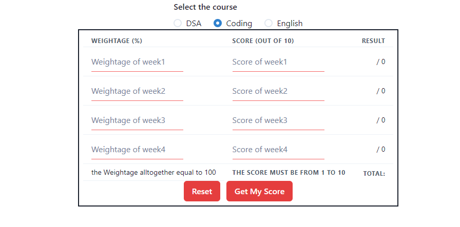

# masaiEvaluvationCalculator
Basically it is a calculator to calculate how much do you scored in the perticular unit..

- Benefits
    - Don't have to do any calculations
    - compatible with both DSA and coding , for MAC,CSBT work is in progress

**DSA** 
Dsa calci(form) looks like this:-



**CODING**
Coding calci(form) looks like this:-


**H**ave any suggestios feel free to clone it and 
```js
git clone https://github.com/Anshul-Singla/masaiEvaluvationCalculator.git
```
